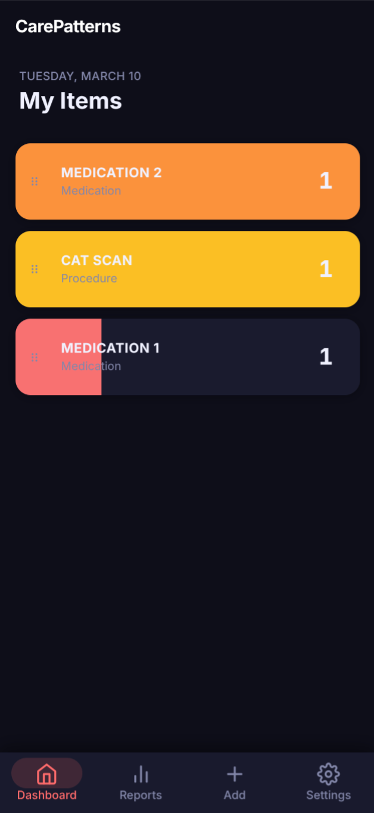
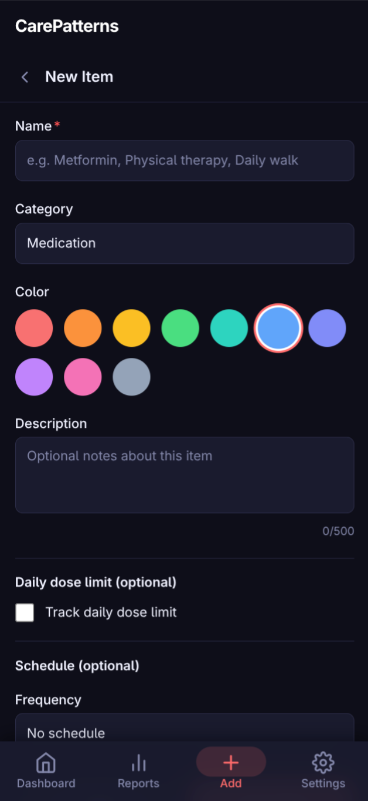
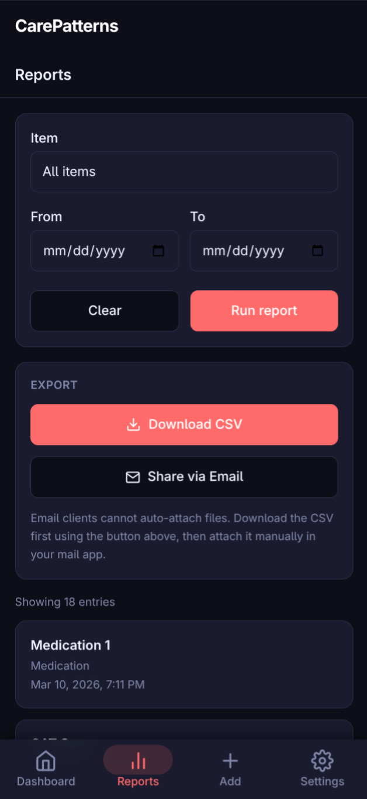
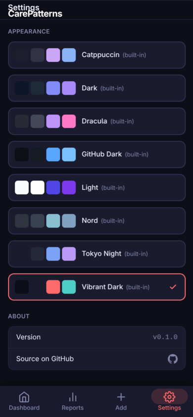

# CarePatterns

A mobile-first habit and care tracker. Log medications, procedures, and goals with a single tap. Set schedules, get in-app reminders, and export your history as CSV.

## Why I Built This

I'm a full-time caregiver for my wife. Day-to-day life involves a lot of moving parts: medications, habits, recurring tasks. Keeping track of everything means having tools that actually work for both of us, not just one of us.

For a while we used an iOS habit-tracking app. I put real time into bending it to fit our situation, even though it was never designed for what we needed. When it moved to a subscription model, the math stopped making sense.

So I built my own. Using Claude Code and OpenAI Codex, I put together something simple and focused on what we actually use day to day. We've been running it for a few months now, and it's held up well enough that I felt comfortable sharing it.

A few things worth knowing before you use it:

**This app is designed for personal, self-hosted use and is not intended to be exposed to the public internet.** In our setup, it runs in a sandboxed Docker environment on our home server and is **only accessible locally or over a VPN/Tailscale connection**.

If you're comfortable running self-hosted services and prefer keeping your data local, you might find it a useful starting point.

## Screenshots

<table>
  <tr>
    <td align="center"></td>
    <td align="center"></td>
    <td align="center"></td>
    <td align="center"></td>
  </tr>
  <tr valign="top">
    <td align="center"><b>Dashboard</b><br/>Tap a card to log a dose. Color fill tracks daily progress. Drag the ⠿ handle to reorder.</td>
    <td align="center"><b>Add Item</b><br/>Name your item, pick a color, set an optional daily dose limit and schedule.</td>
    <td align="center"><b>Reports</b><br/>Filter by item and date range, then download as CSV or share via email.</td>
    <td align="center"><b>Settings</b><br/>Choose from 8 built-in themes. Active theme is highlighted.</td>
  </tr>
</table>

## Running with Docker (recommended)

```bash
cp .env.example .env
# Edit .env — set SECRET_KEY and VITE_API_TOKEN to the same random value
docker compose up -d --build
```

Open `http://localhost:3000`. That's it.

To generate a secure key:
```bash
python -c "import secrets; print(secrets.token_hex(32))"
```

To stop:
```bash
docker compose down
```

Your data lives in a named Docker volume (`carepatterns-data`) and survives restarts. To wipe it completely: `docker compose down -v`.

## Running without Docker

**Backend**
```bash
cd backend
python -m venv .venv
source .venv/bin/activate
pip install -r requirements.txt
uvicorn src.main:app --reload --port 8000
```

**Frontend**
```bash
cd frontend
npm install
npm run dev
```

## Environment variables

| Variable | Required | Description |
|----------|----------|-------------|
| `SECRET_KEY` | Yes | Bearer token the backend validates on every request |
| `VITE_API_TOKEN` | Yes | Same value as `SECRET_KEY` — baked into the frontend bundle at build time |
| `DATABASE_PATH` | Yes | SQLite file path inside the container (default: `/app/data/carepatterns.db`) |
| `ALLOWED_ORIGIN` | No | CORS origin for the backend (default: `http://localhost:3000`) |
| `TIMEZONE` | No | Display timezone for schedules and reports (default: `America/Los_Angeles`) |
| `REMINDER_POLL_INTERVAL_SECONDS` | No | How often the backend checks for overdue items (default: `60`) |
| `VITE_REMINDER_POLL_INTERVAL` | No | How often the frontend polls for reminders in seconds (default: `60`) |

See `.env.example` for a full template with descriptions.

## Ports

| Port | Service |
|------|---------|
| `3000` | Frontend (PWA) |
| `8000` | Backend API |

## Architecture

- **Frontend**: React 18 + Vite + TypeScript + Tailwind CSS
- **Backend**: FastAPI + SQLAlchemy + SQLite
- **Auth**: Static bearer token (set once in `.env`, no login flow)
- **Data**: SQLite on a Docker volume — no external database needed

## Notes

- Single-user only — no accounts, no registration
- `VITE_API_TOKEN` is embedded in the compiled JS bundle. Only run this on a private network.
- CSV exports are named `carepatterns-export-YYYY-MM-DD.csv`
- The email share button opens your mail client with a pre-filled message. You attach the CSV manually — browsers can't auto-attach files via mailto links.
